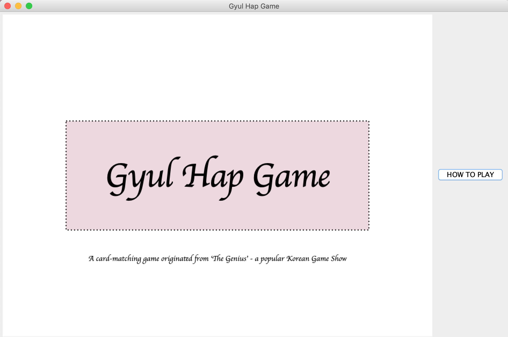

# GyulHap
A card-matching game based off a popular Korean Game show, 'The Genius'

Each round, you will be given 9 cards.
Your task is to find all combinations of three cards that satisfy the 'HAP' condition.
When you have found all card combinations, press 'KYUL' button.

This implementation also provides two difficulty levels: Beginner & Intermediate.

Screenshots of the application
 
 
  
